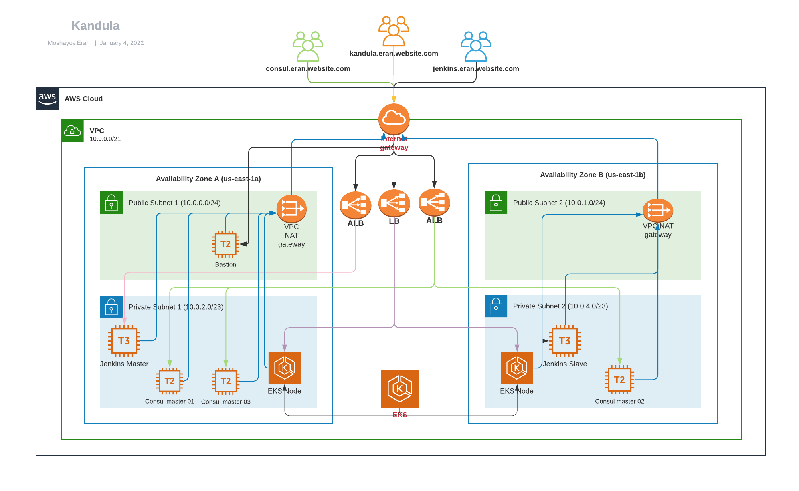

This Repo will aggregate my ops-school project

## Who am I

## Infrastructure architecture diagram

## Application diagram

## Table of Contents

- [Features](#features)
- [Prerequisites](#prerequisites)
- [Deploying Instructions](#deploying-instructions)
- [Variables References Table](#variables-references-table)

## Features

## Prerequisites

## Deploying Instructions

### Available Assignments
- [Terraform-VPC](terraform_vpc) - A deep dive workshop into the different kubernetes controllers, how they work and how to use them.
- [Terraform-Jenkins](terraform_jenkins) - Deep dive into advanced scheduling techniques
- [Terraform-Consul](terraform_consul) - Eran
- [Terraform-EKS](/terraform_eks) - Test
