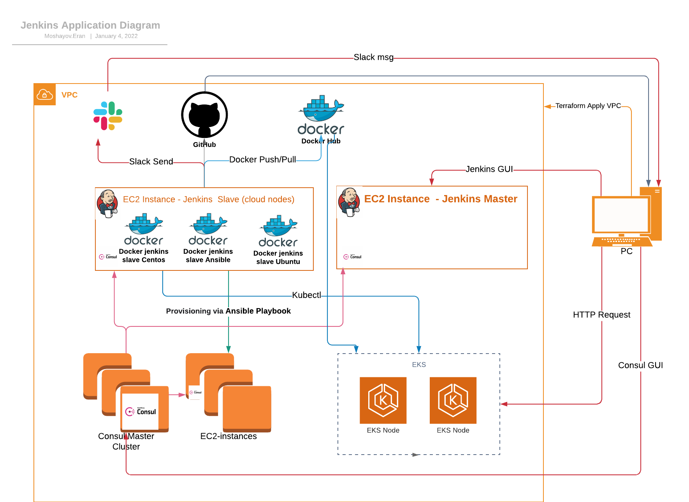

<h1 align="center">Kandula</h1>
<h6 align="center">This Repo will aggregate my ops-school project</h6>

<p align="center"></p>

## Table of Contents

- [Infrastructure Architecture Diagram](#Infrastructure-Architecture-Diagram)
- [Application Diagram](#Application-Diagram)
- [IP Address Allocation](/network_address_design/network_adresses_design.md)
- [Deployment Process](#Deployment-Process)
- [Prerequisites](#prerequisites)
- [Deployment Instructions](#Deployment-Instructions)
- [Application Connections](#Application-Connections)
- [Links to dockerhub related images](#Links-to-dockerhub-related-images)
- [Links to GitHub related repository](#Links-to-GitHub-related-repository)
- [Improvement Points For The Future](#Improvement-points-for-the-future)


## Infrastructure Architecture Diagram


## Application Diagram


## Deployment Process
+ Infrastructure deployment via Terraform
+ EC2 instances provisioning & Consul Application installation (Jenkins job that will run Ansible Playbooks)
+ Kandula App deployment on EKS cluster (Jenkins Job)

## Prerequisites
To deploy all infrastructure you will need below application to be installed on your workstation/server
 + Install [GIT](https://github.com/git-guides/install-git) on your workstation/server
 + Install [Terraform v1.1.2](https://learn.hashicorp.com/tutorials/terraform/install-cli) on your workstation/server
 + Install [aws cli](https://docs.aws.amazon.com/cli/latest/userguide/install-cliv2.html) on your workstation/server
 + Install [kubectl](https://kubernetes.io/docs/tasks/tools/install-kubectl/) on your workstation/server

## Deployment Instructions
Infrastructure deployment will be performed via Terraform locally. 
1. Terraform deployment is divided into five parts when the first execution must be VPC and the sequence of rest is not important
   Run the following on each terrafom_XXX folder
   ```bash
   terraform init
   terraform apply --auto-approve
   ```
+ [Terraform-VPC](/terraform_vpc) - Creating VPC
+ [Terraform-Jenkins](/terraform_jenkins) - Creating Jenkins Master & Jenkins Slave (EC2 instance slave & cloud slaves)
+ [Terraform-Consul](/terraform_consul) - Creating Consul cluster without application (application will be installed via ansible playbook)
+ [Terraform-EKS](/terraform_eks) - Creating Kubernetes cluster with one worker group
+ [Terraform Bastion Server](/terraform_bastion_server) - Creating Bastion server for debugging & maintenance
> note: Bastion server - In order to avoid security issues we're recommending to destroy the machine or turn it off when not needed

2. After deploying the infrastructure via terraform we will need to provision our servers via Ansible playbooks.
All Ansible playbooks will be run via jenkins job ( Ansible installed on the Jenkins-slave).
Jenkins UI : https://jenkins.eran.website/

3. Installing Consul-server on three ec2 instances & Consul-agent on Jenkins-master & Jenkins-slave.
   + please run Jenkins job:
   + [jenkins file location](/Jenkins/jenkins_jobs/jenkins_ansible_playbooks/common_ansible_playbook.groovy)
   + [Ansible Playbooks & roles](/ansible)
   + when done you can access consul GUI and see all consul servers, agents and services, link: https://consul.eran.website/

4. Deploying Kandule Application via Jenkins job.
    + please run Jenkins Job: 
    + [jenkins file location](Jenkins/jenkins_jobs/jenkins_kandula_deployment_eks/jenkins_kandula_deployment_eks.groovy)
    + when done you can access Kandula GUI, Link to Kandula: 


## Application Connections

### Jenkins Master :
| Protocol | Port        | ingress/egress | Description                                                    |
| -------  | ----------- |--------------- | -------------------------------------------------------------- |
| HTTPS    | 443         | ingress        | Allow Jenkins UI                                               |
| HTTP     | 8080        | ingress        | Allow Jenkins UI                                               |
| tcp      | 4243        | ingress        | Allow Docker Remote API                                        |
| tcp      | 32768-60999 | ingress        | Allow Docker Hostport Range                                    |
| tcp      | 22          | ingress        | Allow ssh                                                      |
| all      | all         | egress         | Allow all outgoing traffic                                     |

### Jenkins Slave :
| Protocol | Port        | ingress/egress | Description                                                    |
| -------  | ----------- |--------------- | -------------------------------------------------------------- |
| tcp      | 4243        | ingress        | Allow Docker Remote API                                        |
| tcp      | 32768-60999 | ingress        | Allow Docker Hostport Range                                    |
| tcp      | 22          | ingress        | Allow ssh                                                      |
| all      | all         | egress         | Allow all outgoing traffic                                     |

### Consul :
| Protocol | Port        | ingress/egress | Description                                                    |
| -------  | ----------- |--------------- | -------------------------------------------------------------- |
| HTTPS    | 443         | ingress        | Allow consul  UI                                               |
| HTTP     | 8500        | ingress        | Allow consul  UI                                               |
| tcp      | 8600        | ingress        | Allow to resolve DNS queries                                   |
| tcp, udp | 8301        | ingress        | Allow Serf LAN port                                            |
| tcp, udp | 8302        | ingress        | Allow Serf WAN port                                            |
| tcp      | 8300        | ingress        | Allow Server RPC address                                       |
| tcp      | 21000-21255 | ingress        | Allow for automatically assigned sidecar service registrations |
| tcp      | 22          | ingress        | Allow ssh                                                      |

### EKS :
| Protocol | Port        | ingress/egress | Description                                                    |
| -------  | ----------- |--------------- | -------------------------------------------------------------- |
| tcp      | 22          | ingress        | Allow ssh                                                      |

### Bastian Server :
| Protocol | Port        | ingress/egress | Description                                                    |
| -------  | ----------- |--------------- | -------------------------------------------------------------- |
| tcp      | 22          | ingress        | Allow ssh                                                      |
| all      | all         | egress         | Allow all outgoing traffic                                     |


### Links to dockerhub related images
- [Kandula](https://hub.docker.com/repository/docker/erandocker/ops-school-kandula) - docker pull erandocker/ops-school-kandula:tagname
- [Jenkins Slave Ubuntu-18.04](https://hub.docker.com/repository/docker/erandocker/jenkins-slave-ubuntu-18.4) - docker pull erandocker/jenkins-slave-ubuntu-18.4:tagname
- [Jenkins Slave Centos-7](https://hub.docker.com/repository/docker/erandocker/jenkins-slave-docker-centos-7) - docker pull erandocker/jenkins-slave-docker-centos-7:tagname

### Links to GitHub related repository
- [Terrafom VPC module](https://github.com/eranmos/ops-school-terraform-aws-vpc.git) - Terraform VPC module for AWS VPC, Subnets, Routing, NAT Gateway creation  
- [Kandula Application](git@github.com:eranmos/ops-school-kandula-project-app.git) - Code for Kandule Application

### Improvement Points For The Future
+ Creating Jenkins server & Slave AMI via packer
+ Creating EFS that will mount to Jenkins server & all Jenkins files will be stored on it
+ using [Jenkins Fleet Plugin](https://plugins.jenkins.io/ec2-fleet/) to deploy Jenkins Slaves
+ Moving all terraform deployments to terraform cloud on the same organization and link it to github
+ Creating DNS for Kandula (A record for) as https://kandule.eran.website that will be part of Kandula deployment
