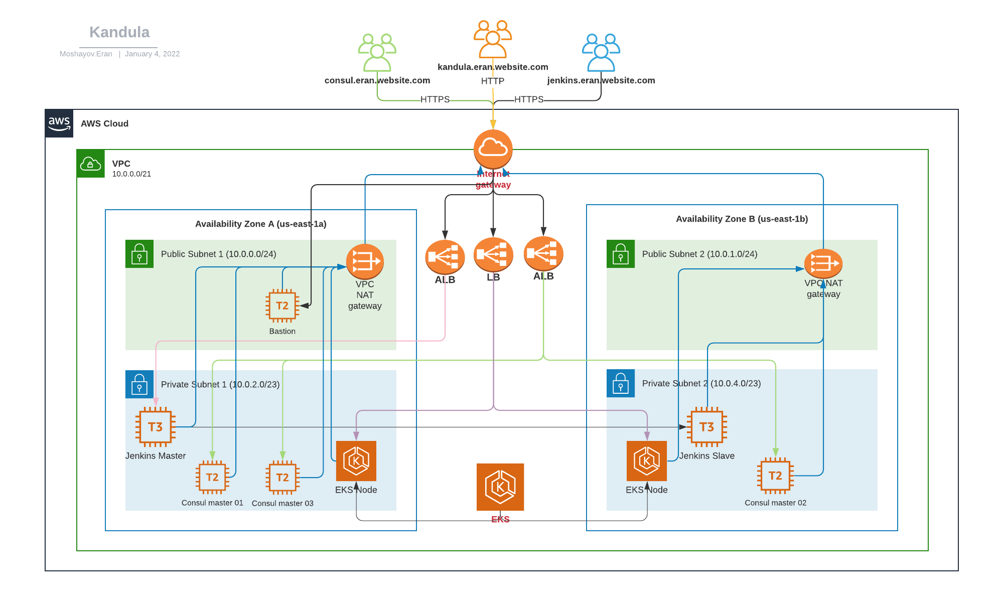

This Repo will aggregate my ops-school project

## Infrastructure architecture diagram

## Application diagram

## Table of Contents

- [Features](#features)
- [Prerequisites](#prerequisites)
- [Deploying Instructions](#deploying-instructions)
- [Variables References Table](#variables-references-table)

## Features

## Prerequisites

## Deploying Instructions

### Project Terraform Deployments 
- [Terraform-VPC](terraform_vpc) - Creating VPC
- [Terraform-Jenkins](terraform_jenkins) - Creating Jenkins Master & Jenkins Slave
- [Terraform-Consul](/terraform_consul) - Creating Consul cluster
- [Terraform-EKS](/terraform_eks) - Creating EKS
