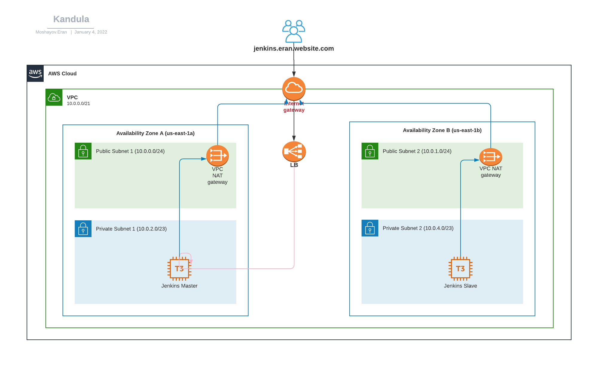
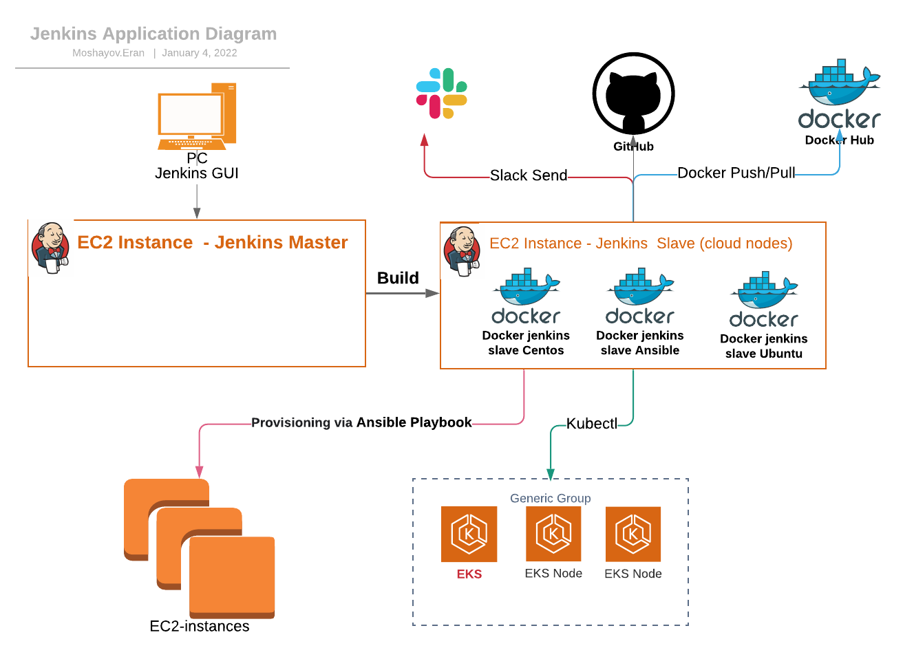

<h1 align="center">Terraform Jenkins</h1>

<h6 align="center">Terraform which creates Jenkins on AWS.</h6>

## Jenkins Infrastructure architecture diagram


## Application diagram



## Table of Contents

- [Prerequisites](#prerequisites)
- [Deploying Instructions](#deploying-instructions)
- [Variables References Table](#variables-references-table)

## Prerequisites
To deploy all infrastructure you will need below application to be installed on your workstation/server
+ Install [GIT](https://github.com/git-guides/install-git) on your workstation/server
+ Install [Terraform v1.1.2](https://learn.hashicorp.com/tutorials/terraform/install-cli) on your workstation/server


## Deploying Instructions

Run the following:
   ```bash
   terraform init
   terraform apply --auto-approve
   ```

## Variables References Table

In below table you can see `variables.tf` file details:

| Variable | Description |
| -------- | ----------- |
| aws_region | AWS working region |
| aws_cli_profile | your awscli profile config |
| key_name | your pem key to access via ssh  |
| jenkins_instance_type | The type of the ec2 |
| jenkins_master_ami | The AMI ID for Jenkins-Master |
| jenkins_slave_instances_count | amount of Jenkins-slave to create  |
| jenkins_slave_ami | The AMI ID for Jenkins-Slave |
| aws_registered_domains | your aws registered domains |
| jenkins_dns | your aws  domains name for Jenkins-Master   |
| default_s3_bucket | AWS s3 bucket for provisioning |
| env_name | tag for your env name |
| owner | tag for owner name |
| project | tag for Project name |
